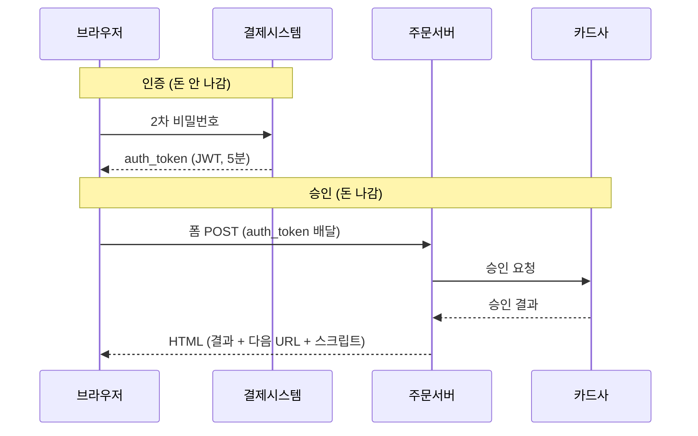

# 설계 노트

> 결정의 근거와 미뤄둔 논의를 남기는 문서. README가 "무엇을 만들었나"라면 이쪽은 "왜 그렇게 했나"와 "무엇을 안 했나"를 담는다.
>
> 코드 주석(TODO)과 나누는 기준은 **붙일 코드 줄이 있는가**다. 있으면 TODO로 그 자리에 두고, 없거나 애매하면 여기에 적는다. TODO는 그 줄을 고치려는 사람이 반드시 보게 되지만, 여기 있는 것은 아무도 열지 않으면 그대로 잊힌다.

---

## 1. 단계별로 한 것

| | 내용 |
|---|---|
| Step 1 | 기동·데이터 접근 환경 |
| Step 2 | 멱등성 — `SELECT FOR UPDATE`, PENDING 만료·재처리 |
| Step 3 | 장바구니·결제·결과 화면, 폴링 |
| Step 4 | 구멍 메우기 — totalPrice 서버 검증, 상품 DB 이관, 예외→HTTP 매핑, 실패 사유 보존 |
| Step 5 | 배송 보장일, 체크아웃 미리보기 API |
| Step 6 (진행 중) | 마감 스케줄러, 5분 룰, 망취소 |

---

## 2. 결정된 것 (근거 포함)

논의 끝에 확정된 것들. 코드만 봐서는 왜 그런지 알기 어려운 것 위주.

**동기 승인 유지 (A안), 비동기 워커(B안) 안 함**
무신사·쿠팡도 동기 승인 + 폴링 폴백으로 운영하는 것을 HAR로 확인. B안의 이유는 정확성이 아니라 부하 특성이라 지금 규모에서 갈 이유가 없다. 전환 조건은 `BillingPaymentFacade`에 TODO.

**배송일은 "예정"이 아니라 "보장"**
못 지킬 날짜는 애초에 팔지 않는다. 그래서 결제 시점에 재검증하고 409로 거부한다. 대부분의 쇼핑몰은 예정이라 안 막지만, 보장을 팔면 이 거부가 필요하다.

**결제 전까지 보장일은 계약이 아니다**
그래서 재시도 시 낡은 값을 갱신한다. 저장값과 대조하면 마감을 넘긴 주문은 영영 결제할 수 없다. 검증 대상이 금액(저장값)과 보장일(지금 계산값)로 다른 이유가 이것.

**5분 룰 — 생성 후 5분 안에 확정, 넘기면 취소**
5분은 임의 값이 아니라 승인 호출의 HTTP 타임아웃(연결 10초 + 읽기 60초 = 최대 70초)에서 유도된다. 취소를 쏠 때 날아다니는 승인 요청이 없다는 것이 보장된다. 업계 표준(망취소)보다 늦게 쏘는 이유는, Toss 취소 API가 승인 응답에만 있는 `tid`를 요구해 **선제적으로 막을 수단이 없기** 때문이다. 조회로 알아내야 하므로 기다렸다 판단할 수밖에 없다.

**404 판정 — 망취소 쪽으로 보내고, 두 번째 조회에도 없으면 종료** *(2026-08-17 결론)*
조회의 404는 "영원히 없음"(요청이 도달한 적 없음)과 "아직 없음"(떠돌다 곧 도착)을 구분하지 못한다. 처리 스케줄러가 판단하지 않고 망취소 경로로 넘기면, 그쪽이 어차피 조회부터 하므로 **시간이 지나며 저절로 판별된다.** 그때도 404면 실제로 없는 것으로 보고 종료.

**마감 배치는 PAID만 조회한다 — 그래서 스케줄러 간 순서 조율이 필요 없다**
미확정 주문은 애초에 대상이 아니고, 5분 룰이 곧 취소로 보낸다. 확인 스케줄러가 늦게 돌면 그 주문은 오늘 못 나가고 취소될 뿐이며 그것이 규칙상 맞는 결과다. 두 잡을 한 잡으로 합치거나 실행 순서를 맞출 이유가 없다. **처음엔 "마감 스윕 → 전달"을 한 잡에 순차로 넣으려 했으나, 문제 자체를 없애는 쪽이 나았다.**

**"망취소 대기" 상태를 만들지 않는다**
`created_at`이 이미 그 정보를 갖는다("PENDING인데 5분 지남"). 상태를 추가하면 같은 사실을 두 곳에서 말하게 된다. 취소 실패 재시도도 PENDING으로 두면 다음 회차에 자동으로 걸린다. 취소 트리거가 둘 이상이 되면(예: 보장 위반) 그때 추가.

**이미 취소된 결제에 취소를 반복하지 않는다**
조회가 매 회차 취소보다 먼저 돌고, 이미 취소된 결제는 `CANCELED` → `Failure`로 끝나 취소 경로에 도달하지 않는다. 별도 처리가 필요 없다.

---

## 3. 논의했지만 안 한 것

코드 TODO에 없는 것들. **여기 안 적으면 잊힌다.**

| | 내용 | 왜 미뤘나 |
|---|---|---|
| **거래대사** | PG 일일 거래 내역과 우리 DB 대조 | 다른 브랜치. **업계가 과감히 종료할 수 있는 근거가 이건데 우리에겐 없다.** 실시간 판단이 최종 판단이 되는 상태 |
| **보장 확인 축** | 약속한 날짜에 실제로 실렸는지 대조 | 없음. 위반이 조용히 지나감. 보장 상품이면 클레임 대응·보상 근거가 되는 축 |
| **영업일 달력** | `plusDays(1)`이 일요일·공휴일·물류사 휴무를 그냥 넘어감 | **주말에 바로 틀린다.** 실제 보장 서비스는 전부 배송 가능일 달력에 대고 계산 |
| **재고** | 물건이 없으면 못 보냄. 보장의 절반 | 범위 밖으로 합의 |
| **지역** | 도서산간 제외/+1일 | 범위 밖으로 합의 |
| **스케줄러 밀림** | 조회가 순차라 Toss가 느리면 회차가 길어짐. Toss가 죽으면 미확정이 쌓이는데 처리는 더 느려짐 | 어디까지 막을지 미정. 선택지: 시간 예산 / 병렬 조회 / 인지만 |
| **취소된 사용자 안내** | 미확정으로 취소된 사람에게 "다시 결제하면 8/18 배송" 같은 안내 없음 | 결과 페이지가 FAILED와 사유만 보여줌 |
| **`AlreadyPending` 안내** | 재시도했는데 옛 거래가 확정되면, 사용자는 새로 결제한 줄 앎 | 안내 없이 결과 페이지로 보냄 |
| **폴링 종료 후 경로** | 2분 폴링이 미확정으로 끝나면 URL 말고 확인할 방법 없음 | 주문내역 화면 부재 |
| **인증** | companySeq가 요청 본문의 숫자. 남의 거래 조회를 막을 수 없음 | 별도 단계. 이게 붙어야 키 파생(코드 TODO)도 의미가 생김 |

**코드에 박힌 TODO** (5개, `grep -rn "TODO" src/main`으로 확인):
B안 전환 / 승인 후 DB 실패 / 보장 위반 처분 / 키에 companySeq 섞기 / seek 페이징

---

## 4. 실서비스 분석 결론 (HAR 실측)

### 4-1. 셋 다 승인은 서버가 한다. 차이는 인증 단계 유무.

| | 인증 (돈 안 나감) | 승인 (돈 나감) | 결과 확인 |
|---|---|---|---|
| 무신사 | 브라우저 (Toss 브랜드페이 SDK, 2차 비번) | **무신사 서버** `/process` | HTML 응답 |
| 쿠팡 | 브라우저 (쿠페이 iframe, 2차 비번) | **쿠팡 서버** `v4/payments/result` | HTML 응답 |
| 네이버 | (주문 프로세스 내) | **네이버 서버**, 비동기 | 조회 API + 실시간채널 |
| **우리** | **없음** — 빌링키 발급 때 완료 | **우리 서버** `POST /api/payments` | 응답 + PENDING시 폴링 |

**우리 `billingKey`가 사실상 "만료 없는 인증 토큰"이다.** 남들은 결제마다 5분/20분짜리 토큰을 새로 받는다.

### 4-2. 요청 순서

**쿠팡**
- `GET payments/payment` — 결제창(iframe). HTML에 `returnUrl`이 심겨 있음
- `POST pay/authentication` — 인증 세션
- `POST encryption/getPublicKey` — RSA 공개키 (exponent `010001`=65537)
- `POST myPage/password/verify-password` — **2차 비밀번호**
- `POST encryption/getPublicKey` — 승인용으로 한 번 더
- `POST payAuthAction` — **인증 완료**, `authToken`(JWT) 발급. 여기까지 돈 안 나감
- `POST v4/payments/result` — **승인** (1.5~2초). 서버가 카드사에 청구
- `GET checkout/paymentResult` → `GET thank-you`

**무신사**
- `POST orders/order-no` → `POST orders/{orderNo}/ready` → `POST orders/payment-session`
- 팝업(Toss 브랜드페이): **2차 비번 → 인증**, `auth_token`(JWT, 5분) 발급
- `POST orders/process` — **승인** (622ms~1,419ms)
- `GET order/result/{orderNo}`

**네이버**
- `POST order/process` → `{"code":"00","message":"성공"}` (접수만)
- 9초 뒤 `state`: `ORDER_STARTED` → `ORDER_INVALIDATED`, `version` 4→10 (비동기 처리 증거)
- 실패 사유에 카드사 원본 코드: `code=4501`, `cardCompanyCode=C3`, "카드 한도 초과"



### 4-3. 실험으로 확인한 것
- **쿠팡, 한도초과 카드**: 인증(`payAuthAction`)은 `resultCode:"SUCCESS"`. 승인에서 `success:false`, `paymentFailureCode:"APPROVAL_FAILURE"`, `paymentFailCode=EXCEED_PAY_AMOUNT`. **쿠팡 코드가 스스로 "승인 실패"라고 명명**
- **무신사, 잔액부족**: 팝업 인증 통과·`auth_token` 발급됨. 승인(`/process`)에서 `result=FAIL`, `errorCode=ORDER-104-0001`
- **쿠팡, 인증 직후 네트워크 차단**: `payAuthAction` 응답 10ms 뒤 끊김 → `v4/payments/result` 미발송 → **돈 안 나감(확인)**

→ **인증은 본인확인만 한다. 잔액도 한도도 안 본다.**

### 4-4. 위험 구간은 두 개 — 인증-승인 분리는 (A)만 막는다
```
브라우저 ──(A)──> 서버 ──(B)──> 카드사
```
| | (A) 끊김 | (B) 타임아웃 |
|---|---|---|
| 무신사·쿠팡 | 안전 (승인 시작조차 안 함) | **위험 — 서버도 모름** |
| 우리 | **위험** (요청 도달 = 곧 승인) → 결과페이지+폴링 필요 | **위험 (동일)** |

**(B)는 넷 다 동일한 문제**이고 표준 해법이 **망취소(NetCancel)**. 나이스페이 문서: *"승인 API 호출시 Connection time-out이 발생한 경우 거래대사 불일치 방지를 위해 망취소 요청을 진행"*.

### 4-5. auth_token 계층
```
무신사: {"iss":"mpay-api","pgData":"{\"paymentKey\":\"op_MU2026…\"}","exp":+300초,"jti":주문번호+발급시각}
        └ pgData 안 op_MU…가 Toss 결제 키. 무신사페이가 서명해 감쌈. exp 정확히 5분
쿠팡:   {"serviceType":"PAYMENT","id":거래ID,"exp":…}
        └ 자체 PG라 pgData 불필요. 주문 대조는 URL 서명으로:
          v4/payments/result/PARITY_WEB_RESULT/COUPANG/{거래ID}/{추측불가 서명}
```
무신사는 토큰에 정보를 다 넣고 주소 고정, 쿠팡은 토큰을 얇게 두고 주소를 비밀로. 우리는 브라우저 경유로 승인 권한을 안 넘기므로 불필요. **단 인증/로그인이 붙으면 "요청자가 정말 그 companySeq의 주인인가" 검증이 그 자리를 대체해야 한다.**

### 4-6. 승인 엔드포인트는 HTML을 내려준다
URL만 API처럼 생겼고(`/api2/…`, `/v4/…`) `_resourceType: document`, 폼 POST 페이지 이동. **결과값 + 다음에 갈 URL + 처리 스크립트가 응답 HTML에 다 있다.** 그래서 클라이언트에 결과 처리 코드가 없어도 되고 폴링도 불필요.
- 무신사 `/process`: hidden input(`result`,`code`,`errorCode`,`message`,`state`) + `window.onload → goResult()`. 성공/실패 같은 페이지, 값만 다름. "결제중입니다" 로딩 화면이 배경
- 쿠팡 `v4/payments/result`: `__PRELOADED_STATE__`(`success`,`returnUrl`,`failUrl`) + React `PaymentResult.js`. `alert3()`/`confirm3()`를 페이지에 미리 심어둠
- 국내 PG 결제창 표준. 무신사 파라미터에 KCP 흔적: `ordr_idxx`, `good_mny`, `res_cd`, `Ret_URL`, `old_pg_kind=kcp`

### 4-7. 실패 시 셋 다 장바구니를 유지하고 되돌린다
- 무신사: 알럿 → `/order/order-form` 또는 `/order/cart`. `code=110/115/117/118`(재고부족·회원전용·장바구니 이상)은 장바구니로. `state>0`이면 "다시 결제하시겠습니까?" confirm
- 쿠팡: `returnUrl`을 `/cart/checkout?item[]=94914174862:1&paymentFailCode=EXCEED_PAY_AMOUNT`로 바꿔 **상품 유지한 채** 체크아웃 복귀
- 무신사는 재시도마다 orderNo를 새로 발급(캡처에서 4개 생성, 3개 버려짐). 준비단계엔 돈이 안 움직이니 무해

---

## 5. 확인하지 못한 것 (추측 금지)

- 무신사 `/process` 스크립트에 성공/실패 판정보다 **먼저** 검사되는 `isRedirect` 분기가 있다(`true`면 서버가 준 message를 알럿 **제목**에 띄우고 `orgServer + redirectUrl`로 이동, 외부 도메인 불가). 쿠팡에도 `resultType`/`redirect`/`messageTitle`/`buttonText` 빈 필드가 있다. **모든 캡처에서 비어 있었고 발동을 못 봤다.** 승인 타임아웃 안내용일 수도, 점검 공지 등 전혀 다른 용도일 수도 있음
- 서버 내부 리트라이/조회 존재 여부. 관찰된 응답이 전부 1~2초(무신사 622ms·1,419ms, 쿠팡 1,994ms·1,525ms)라 **재시도가 들어갈 여유가 없었다** = 있었다 해도 발동 안 함. 정황: 네이버 `orderProcessValidationFailureIgnoredAsTooLong`, 쿠팡 `prePayType // ASYNC_PAY_REPAYMENT`
- 쿠팡 `PARITY`는 대사(reconciliation)가 아니라 **feature parity** (코드 주석 `// From TW Apple Pay parity`, `// From KR PC before parity`, `// From Linepay before parity`)

---

## 6. 작업 규칙 (사용자 지정)

- **테스트·빌드 자동 실행 금지.** 물어보고 실행
- Plan 모드에서는 계획을 끝낸 뒤 최종 diff를 보여줄 것
- `let` 대신 `if`문 선호. sealed 타입 활용
- 메서드는 가능한 좁은 가시성으로 캡슐화
- 코드 인용 시 원문 그대로 붙이고, 설명은 밖으로 뺄 것
