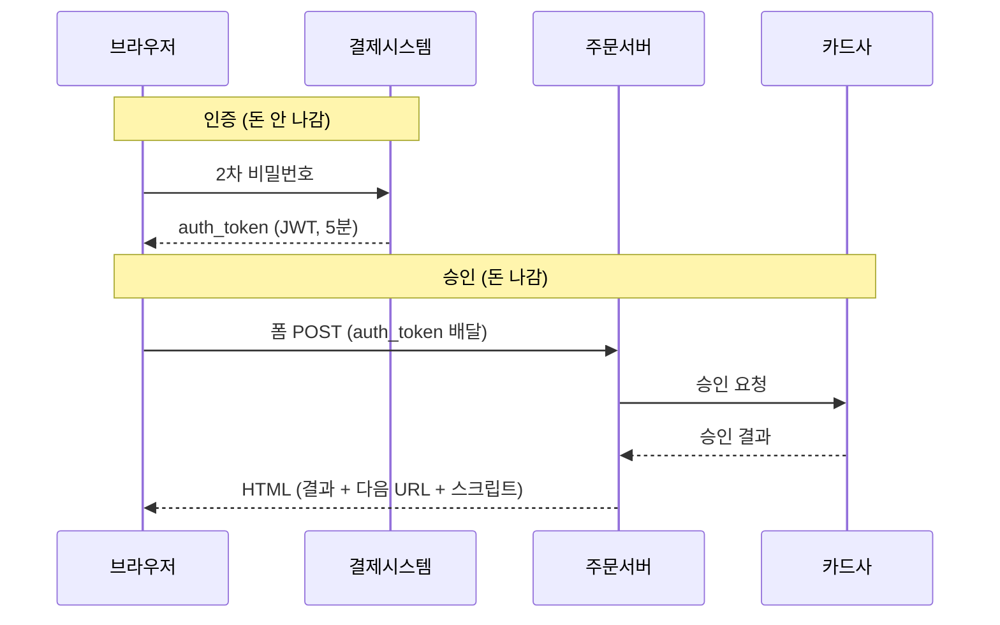

# 실서비스 결제 흐름 분석 (HAR 실측)

> 2026-08-13~14. 무신사·쿠팡·네이버의 결제 과정을 브라우저 네트워크 캡처로 떠서 비교한 기록.
> 실패 케이스(잔액부족·한도초과)와 네트워크 강제 차단까지 실험으로 확인했다.
>
> 이 프로젝트가 왜 지금 구조인지의 근거 자료다. 결정 자체는 [NOTES.md](../NOTES.md)에 있다.

---

## 1. 분석 결과

### 1-1. 셋 다 승인은 서버가 한다. 차이는 인증 단계 유무.

| | 인증 (돈 안 나감) | 승인 (돈 나감) | 결과 확인 |
|---|---|---|---|
| 무신사 | 브라우저 (Toss 브랜드페이 SDK, 2차 비번) | **무신사 서버** `/process` | HTML 응답 |
| 쿠팡 | 브라우저 (쿠페이 iframe, 2차 비번) | **쿠팡 서버** `v4/payments/result` | HTML 응답 |
| 네이버 | (주문 프로세스 내) | **네이버 서버**, 비동기 | 조회 API + 실시간채널 |
| **우리** | **없음** — 빌링키 발급 때 완료 | **우리 서버** `POST /api/payments` | 응답 + PENDING시 폴링 |

**우리 `billingKey`가 사실상 "만료 없는 인증 토큰"이다.** 남들은 결제마다 5분/20분짜리 토큰을 새로 받는다.

### 1-2. 요청 순서

**쿠팡**
- `GET payments/payment` — 결제창(iframe). HTML에 `returnUrl`이 심겨 있음
- `POST pay/authentication` — 인증 세션
- `POST encryption/getPublicKey` — RSA 공개키 (exponent `010001`=65537)
- `POST myPage/password/verify-password` — **2차 비밀번호**
- `POST encryption/getPublicKey` — 승인용으로 한 번 더
- `POST payAuthAction` — **인증 완료**, `authToken`(JWT) 발급. 여기까지 돈 안 나감
- `POST v4/payments/result` — **승인** (1.5~2초). 서버가 카드사에 청구
- `GET checkout/paymentResult` → `GET thank-you`

**무신사**
- `POST orders/order-no` → `POST orders/{orderNo}/ready` → `POST orders/payment-session`
- 팝업(Toss 브랜드페이): **2차 비번 → 인증**, `auth_token`(JWT, 5분) 발급
- `POST orders/process` — **승인** (622ms~1,419ms)
- `GET order/result/{orderNo}`

**네이버**
- `POST order/process` → `{"code":"00","message":"성공"}` (접수만)
- 9초 뒤 `state`: `ORDER_STARTED` → `ORDER_INVALIDATED`, `version` 4→10 (비동기 처리 증거)
- 실패 사유에 카드사 원본 코드: `code=4501`, `cardCompanyCode=C3`, "카드 한도 초과"



### 1-3. 실험으로 확인한 것
- **쿠팡, 한도초과 카드**: 인증(`payAuthAction`)은 `resultCode:"SUCCESS"`. 승인에서 `success:false`, `paymentFailureCode:"APPROVAL_FAILURE"`, `paymentFailCode=EXCEED_PAY_AMOUNT`. **쿠팡 코드가 스스로 "승인 실패"라고 명명**
- **무신사, 잔액부족**: 팝업 인증 통과·`auth_token` 발급됨. 승인(`/process`)에서 `result=FAIL`, `errorCode=ORDER-104-0001`
- **쿠팡, 인증 직후 네트워크 차단**: `payAuthAction` 응답 10ms 뒤 끊김 → `v4/payments/result` 미발송 → **돈 안 나감(확인)**

→ **인증은 본인확인만 한다. 잔액도 한도도 안 본다.**

### 1-4. 위험 구간은 두 개 — 인증-승인 분리는 (A)만 막는다
```
브라우저 ──(A)──> 서버 ──(B)──> 카드사
```
| | (A) 끊김 | (B) 타임아웃 |
|---|---|---|
| 무신사·쿠팡 | 안전 (승인 시작조차 안 함) | **위험 — 서버도 모름** |
| 우리 | **위험** (요청 도달 = 곧 승인) → 결과페이지+폴링 필요 | **위험 (동일)** |

**(B)는 넷 다 동일한 문제**이고 표준 해법이 **망취소(NetCancel)**. 나이스페이 문서: *"승인 API 호출시 Connection time-out이 발생한 경우 거래대사 불일치 방지를 위해 망취소 요청을 진행"*.

### 1-5. auth_token 계층
```
무신사: {"iss":"mpay-api","pgData":"{\"paymentKey\":\"op_MU2026…\"}","exp":+300초,"jti":주문번호+발급시각}
        └ pgData 안 op_MU…가 Toss 결제 키. 무신사페이가 서명해 감쌈. exp 정확히 5분
쿠팡:   {"serviceType":"PAYMENT","id":거래ID,"exp":…}
        └ 자체 PG라 pgData 불필요. 주문 대조는 URL 서명으로:
          v4/payments/result/PARITY_WEB_RESULT/COUPANG/{거래ID}/{추측불가 서명}
```
무신사는 토큰에 정보를 다 넣고 주소 고정, 쿠팡은 토큰을 얇게 두고 주소를 비밀로. 우리는 브라우저 경유로 승인 권한을 안 넘기므로 불필요. **단 인증/로그인이 붙으면 "요청자가 정말 그 companySeq의 주인인가" 검증이 그 자리를 대체해야 한다.**

### 1-6. 승인 엔드포인트는 HTML을 내려준다
URL만 API처럼 생겼고(`/api2/…`, `/v4/…`) `_resourceType: document`, 폼 POST 페이지 이동. **결과값 + 다음에 갈 URL + 처리 스크립트가 응답 HTML에 다 있다.** 그래서 클라이언트에 결과 처리 코드가 없어도 되고 폴링도 불필요.
- 무신사 `/process`: hidden input(`result`,`code`,`errorCode`,`message`,`state`) + `window.onload → goResult()`. 성공/실패 같은 페이지, 값만 다름. "결제중입니다" 로딩 화면이 배경
- 쿠팡 `v4/payments/result`: `__PRELOADED_STATE__`(`success`,`returnUrl`,`failUrl`) + React `PaymentResult.js`. `alert3()`/`confirm3()`를 페이지에 미리 심어둠
- 국내 PG 결제창 표준. 무신사 파라미터에 KCP 흔적: `ordr_idxx`, `good_mny`, `res_cd`, `Ret_URL`, `old_pg_kind=kcp`

### 1-7. 실패 시 셋 다 장바구니를 유지하고 되돌린다
- 무신사: 알럿 → `/order/order-form` 또는 `/order/cart`. `code=110/115/117/118`(재고부족·회원전용·장바구니 이상)은 장바구니로. `state>0`이면 "다시 결제하시겠습니까?" confirm
- 쿠팡: `returnUrl`을 `/cart/checkout?item[]=94914174862:1&paymentFailCode=EXCEED_PAY_AMOUNT`로 바꿔 **상품 유지한 채** 체크아웃 복귀
- 무신사는 재시도마다 orderNo를 새로 발급(캡처에서 4개 생성, 3개 버려짐). 준비단계엔 돈이 안 움직이니 무해

---

## 2. 확인하지 못한 것 (추측 금지)

- 무신사 `/process` 스크립트에 성공/실패 판정보다 **먼저** 검사되는 `isRedirect` 분기가 있다(`true`면 서버가 준 message를 알럿 **제목**에 띄우고 `orgServer + redirectUrl`로 이동, 외부 도메인 불가). 쿠팡에도 `resultType`/`redirect`/`messageTitle`/`buttonText` 빈 필드가 있다. **모든 캡처에서 비어 있었고 발동을 못 봤다.** 승인 타임아웃 안내용일 수도, 점검 공지 등 전혀 다른 용도일 수도 있음
- 서버 내부 리트라이/조회 존재 여부. 관찰된 응답이 전부 1~2초(무신사 622ms·1,419ms, 쿠팡 1,994ms·1,525ms)라 **재시도가 들어갈 여유가 없었다** = 있었다 해도 발동 안 함. 정황: 네이버 `orderProcessValidationFailureIgnoredAsTooLong`, 쿠팡 `prePayType // ASYNC_PAY_REPAYMENT`
- 쿠팡 `PARITY`는 대사(reconciliation)가 아니라 **feature parity** (코드 주석 `// From TW Apple Pay parity`, `// From KR PC before parity`, `// From Linepay before parity`)

---
